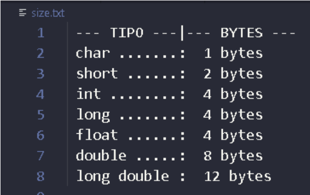

## Atividades Práticas

1. Implemente uma função que receba como parâmetro três números e realize a soma destes números. Implemente outra
função para escrever o resultado no arquivo "soma.txt".

2. Implemente uma função que leia um valor inteiro no arquivo "soma.txt". Retorne o valor que foi lido no arquivo.

3. Implemente uma função que leia três números do arquivo "numeros.txt", e realize a soma destes números. Escreva o
resultado no arquivo "soma.dat".

4. Utilizando a função sizeof(), implemente o programa abaixo. 

