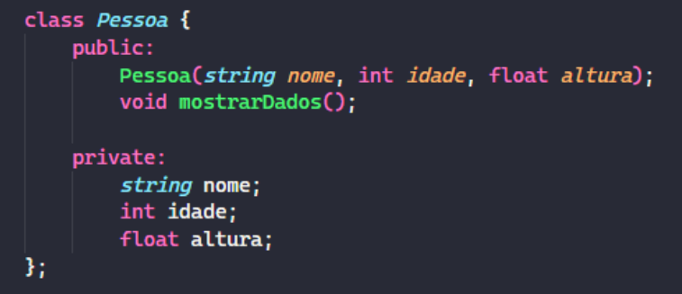
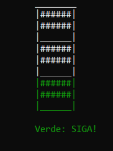

## Atividade Prática

1. Considere a seguinte classe referente aos dados de uma pessoa. Crie os métodos apresentados. Mostre o resultado na
   função main().

   
2. Elabore uma classe chamada Semaforo que seja capaz de alterar as cores de um semáforo (verde, amarelo e vermelho). Mostre com uma interface intuitiva as chamadas aos métodos da classe. Sugestão: utilize a função Sleep para definir
   intervalos entre as mudanças de cores e exibição no terminal.

   
3. Dado o arquivo teams.txt a seguir, elabore um programa com Classes que faça a leitura do arquivo e salve corretamente os 8 grupos da Copa do Mundo (A a H). Exiba os grupos com seus respectivos times para o usuário.
4. Otimize o exercício anterior implementando a TAD de Lista Encadeada para os grupos da Copa. Crie uma interface amigável de navegação entre PRÓXIMO e ANTERIOR (grupo).
